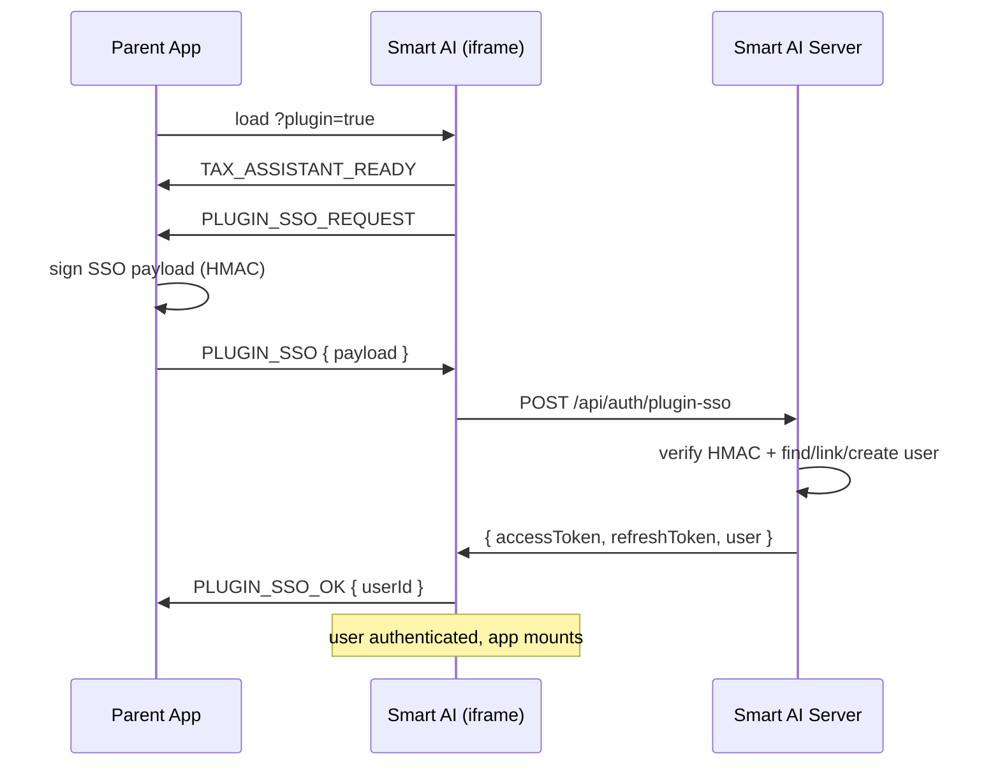

# Smart AI — Plugin Integration Guide

This document is for teams embedding Smart AI (`https://ai.smartbizin.com` tax assistant) inside their own web app via an iframe. It covers the SSO handshake and the bidirectional `postMessage` protocol.

---

## 1. Embed the iframe

```html
<iframe
  id="smart-ai"
  src="https://ai.smartbizin.com/?plugin=true"
  allow="clipboard-write"
  style="width:100%;height:720px;border:0;border-radius:16px;"
></iframe>
```

Adding `?plugin=true` activates plugin mode inside Smart AI:
- Removes the left sidebar and nav header (the host app provides its own chrome)
- Forces the SSO handshake in place of the login screen
- Enables the full bidirectional message protocol described below

---

## 2. SSO Handshake (required)

Plugin mode will NOT allow guest access. On first load Smart AI posts a `PLUGIN_SSO_REQUEST` message. The host must respond with a signed `PLUGIN_SSO` message. The iframe POSTs it to `/api/auth/plugin-sso`, which verifies the signature, finds-or-creates a Smart AI user linked to the host's `userId`, and issues a JWT.

### 2.1 Signing

Both sides share a secret (`PLUGIN_SSO_SECRET` / `SMART_AI_PLUGIN_SECRET`). Generate a 64-byte hex value once and store it in both apps' env vars.

Signature base string (colon-separated, in **exact order**, with empty strings for missing optional fields):

```
${userId}:${email}:${name}:${timestamp}:${nonce}:${plan ?? ''}:${limits ? JSON.stringify(limits) : ''}:${role ?? ''}:${consultantId ?? ''}
```

```
signature = HMAC-SHA256(secret, baseString).hex()
```

All optional fields (`plan`, `limits`, `role`, `consultantId`) **must** be included in the base string even when absent — pass an empty string. `limits`, if present, must be serialized with the exact JSON used in the payload (same key order / whitespace). The safest approach is to stringify once into a variable and reuse it for both the signature and the payload.

Payload sent to the iframe:

```json
{
  "type": "PLUGIN_SSO",
  "payload": {
    "userId": "host-user-id-123",
    "email": "user@example.com",
    "name": "Jane Doe",
    "timestamp": 1735000000000,
    "nonce": "4f8a...random...",
    "plan": "enterprise-shared",
    "role": "staff",
    "consultantId": "consultant-42",
    "limits": {
      "messages": { "limit": 500, "period": "month" },
      "attachments": 50,
      "suggestions": 100,
      "notices": 10,
      "profiles": 5
    },
    "signature": "b5e3...64-hex..."
  }
}
```

Minimal payload (no shared plan, no limit overrides):

```json
{
  "type": "PLUGIN_SSO",
  "payload": {
    "userId": "host-user-id-123",
    "email": "user@example.com",
    "name": "Jane Doe",
    "timestamp": 1735000000000,
    "nonce": "4f8a...random...",
    "signature": "b5e3...64-hex..."
  }
}
```
(Note: the base string still includes four trailing `::::` separators for the absent optional fields.)

### 2.2 Replay protection

`timestamp` is rejected if it differs from server time by more than **5 minutes**. Use the current time when signing — do not pre-generate tokens.

Always generate a new `nonce` per handshake (any random string). While Smart AI currently does not store nonces, they are required for future replay-cache support.

### 2.3 Node.js signing example

```js
import crypto from 'crypto';

/**
 * @param {object} user  { id, email, name }
 * @param {object} [opts]
 * @param {string} [opts.plan]           'free' | 'pro' | 'enterprise' | 'enterprise-shared'
 * @param {object} [opts.limits]         per-feature overrides — see §3.1
 * @param {string} [opts.role]           'consultant' | 'staff' | 'client'
 * @param {string} [opts.consultantId]   parent-app consultant id (staff/client only)
 */
function signPluginSso(user, opts = {}) {
  const timestamp = Date.now();
  const nonce = crypto.randomBytes(16).toString('hex');
  const secret = process.env.SMART_AI_PLUGIN_SECRET;

  // Canonicalize limits exactly once — use the same string for signing and for the payload
  const limitsJson = opts.limits !== undefined ? JSON.stringify(opts.limits) : '';

  const baseString = [
    user.id,
    user.email,
    user.name,
    String(timestamp),
    nonce,
    opts.plan ?? '',
    limitsJson,
    opts.role ?? '',
    opts.consultantId ?? '',
  ].join(':');

  const signature = crypto
    .createHmac('sha256', secret)
    .update(baseString)
    .digest('hex');

  const payload = {
    userId: user.id,
    email: user.email,
    name: user.name,
    timestamp,
    nonce,
    signature,
  };
  if (opts.plan) payload.plan = opts.plan;
  if (opts.limits) payload.limits = opts.limits;
  if (opts.role) payload.role = opts.role;
  if (opts.consultantId) payload.consultantId = opts.consultantId;
  return payload;
}
```

**IMPORTANT:** Compute the signature server-side. Never expose the shared secret to the browser.

### 2.4 Python signing example

```python
import hmac, hashlib, time, secrets, json

def sign_plugin_sso(user, secret, *, plan=None, limits=None, role=None, consultant_id=None):
    timestamp = int(time.time() * 1000)
    nonce = secrets.token_hex(16)
    limits_json = json.dumps(limits) if limits is not None else ""

    base_string = ":".join([
        user["id"], user["email"], user["name"], str(timestamp), nonce,
        plan or "", limits_json, role or "", consultant_id or "",
    ])
    signature = hmac.new(secret.encode(), base_string.encode(), hashlib.sha256).hexdigest()

    payload = {
        "userId": user["id"],
        "email": user["email"],
        "name": user["name"],
        "timestamp": timestamp,
        "nonce": nonce,
        "signature": signature,
    }
    if plan: payload["plan"] = plan
    if limits is not None: payload["limits"] = limits
    if role: payload["role"] = role
    if consultant_id: payload["consultantId"] = consultant_id
    return payload
```

### 2.5 Consultant / enterprise-shared model

When a consultant in the parent app buys an **enterprise-shared** plan, they can allocate a pool of Smart AI capacity across their staff and clients. The parent app is the sole source of truth for how the pool is split — Smart AI simply enforces whatever limits are pushed on each handshake.

**Recommended payload fields for each role:**

| Role | `plan` | `role` | `consultantId` | `limits` |
|---|---|---|---|---|
| The consultant themselves | `"enterprise-shared"` | `"consultant"` | *(omit)* | their total pool (or any subset they reserve for themselves) |
| A staff member | `"enterprise-shared"` | `"staff"` | consultant's parent-app id | the slice the consultant allocated |
| A client | `"enterprise-shared"` | `"client"` | consultant's parent-app id | the slice the consultant allocated |

Limits are **replaced** on every handshake — pass the full current allocation each time. Omitting `limits` clears any previously-stored override on the user record.

**How the parent app should track usage:**
- The parent app owns the "Smart AI settings" page where the consultant configures per-staff/per-client allocations
- The parent app is responsible for ensuring `SUM(allocations) ≤ consultant.pool`
- Smart AI's `USAGE_UPDATE` message (iframe → parent) reports current consumption so the parent can show live progress bars per user and raise alerts if anyone is about to hit their cap
- There is no server-to-server sync — everything flows through the signed SSO handshake

### 2.6 Account linking semantics

Smart AI looks up the user in this order:

1. `findByExternalId(userId)` — returning session, use as-is.
2. `findByEmail(email)` — existing Smart AI account with the same email → **silently linked** by storing `external_id`. All existing chats/notices/profiles are preserved.
3. Neither found → a new Smart AI account is created with password-less login scoped to `external_id`.

Because email collision auto-links, the host is fully trusted to verify email ownership. If your user has an unverified email, do NOT send them through the plugin.

---

## 3. Message Protocol

All messages are JSON objects with a `type` discriminator. Both sides MUST validate `event.origin` against their allow-list before processing.

### 3.1 Parent → Iframe

| type | Payload | Description |
|---|---|---|
| `SET_THEME` | `{ dark: boolean }` | Force light/dark mode. |
| `PLUGIN_SSO` | `{ payload: SsoPayload }` | Response to `PLUGIN_SSO_REQUEST`. |
| `SET_VIEW` | `{ view: 'chat' \| 'calculator' \| 'dashboard' \| 'plan' \| 'notices' \| 'settings' }` | Switch the active view. |
| `SET_CALCULATOR_TAB` | `{ tab: 'income' \| 'capitalGains' \| 'gst' \| 'tds' \| 'advanceTax' \| 'salary' \| 'investment' }` | Pre-select a calculator tab (also switches to the calculator view). |
| `LOGOUT` | `{}` | Force logout of the iframe (e.g. host user signed out). |

#### SsoPayload schema

```ts
{
  userId: string;       // required — parent's user id
  email: string;        // required
  name: string;         // required
  timestamp: number;    // required — ms since epoch (±5 min replay window)
  nonce: string;        // required — random per-request
  signature: string;    // required — hex HMAC-SHA256, see §2.1

  // Optional — for enterprise-shared / consultant plans
  plan?: 'free' | 'pro' | 'enterprise' | 'enterprise-shared';
  role?: 'consultant' | 'staff' | 'client';
  consultantId?: string;
  limits?: {
    messages?: { limit: number; period: 'day' | 'month' };
    attachments?: number;   // monthly cap
    suggestions?: number;   // monthly cap
    notices?: number;       // monthly cap
    profiles?: number;      // total cap
  };
}
```

All optional fields are part of the HMAC signature (see §2.1). Missing optional fields contribute an empty string to the base string.

### 3.2 Iframe → Parent

| type | Payload | Description |
|---|---|---|
| `TAX_ASSISTANT_READY` | `{}` | Sent immediately on mount — host should prepare + send `PLUGIN_SSO`. |
| `TAX_ASSISTANT_HEIGHT` | `{ payload: { height: number } }` | Body height changed — used for iframe auto-sizing. |
| `PLUGIN_SSO_REQUEST` | `{}` | Explicit request for the host to send a `PLUGIN_SSO` token. |
| `PLUGIN_SSO_OK` | `{ userId: string }` | Handshake succeeded for this `userId`. |
| `PLUGIN_SSO_ERROR` | `{ error: string }` | Handshake failed (invalid signature, expired, etc.). |
| `CLOSE_PLUGIN` | `{}` | User clicked the close button inside the iframe. Host should hide/unmount. |
| `MINIMIZE_PLUGIN` | `{}` | User clicked minimize. Host should collapse to its preferred minimized state. |
| `NAVIGATE_TO` | `{ url: string }` | Plugin wants the host to open a URL (e.g. a PDF reference) in a new tab. |
| `USAGE_UPDATE` | `{ plan: string; feature: string; used: number; limit: number }` | Plugin reporting current usage for display/upsell in the host. |
| `ERROR_EVENT` | `{ message: string; code?: string }` | Plugin encountered an error worth logging centrally. |

---

## 4. Host-side reference implementation

```js
const ALLOWED_ORIGIN = 'https://ai.smartbizin.com';
const iframe = document.getElementById('smart-ai');

window.addEventListener('message', async (event) => {
  if (event.origin !== ALLOWED_ORIGIN) return;

  switch (event.data?.type) {
    case 'TAX_ASSISTANT_READY':
    case 'PLUGIN_SSO_REQUEST': {
      // Fetch a freshly-signed SSO token from YOUR backend
      const res = await fetch('/api/smart-ai/sso-token');
      const payload = await res.json();
      iframe.contentWindow.postMessage({ type: 'PLUGIN_SSO', payload }, ALLOWED_ORIGIN);
      break;
    }
    case 'TAX_ASSISTANT_HEIGHT':
      iframe.style.height = event.data.payload.height + 'px';
      break;
    case 'PLUGIN_SSO_OK':
      console.log('Smart AI linked to user', event.data.userId);
      break;
    case 'PLUGIN_SSO_ERROR':
      console.error('Smart AI SSO failed', event.data.error);
      break;
    case 'CLOSE_PLUGIN':
      iframe.style.display = 'none';
      break;
    case 'MINIMIZE_PLUGIN':
      iframe.classList.add('minimized');
      break;
    case 'NAVIGATE_TO':
      window.open(event.data.url, '_blank', 'noopener');
      break;
    case 'USAGE_UPDATE':
      console.log('Usage', event.data.feature, event.data.used, '/', event.data.limit);
      break;
    case 'ERROR_EVENT':
      console.error('Plugin error', event.data.code, event.data.message);
      break;
  }
});

// Sending commands to the iframe:
function openCalculator(tab) {
  iframe.contentWindow.postMessage(
    { type: 'SET_CALCULATOR_TAB', tab },
    ALLOWED_ORIGIN,
  );
}
```

---

## 5. Allowed origins

Both the Express CORS allow-list and the client-side origin check read from env:

- **Server**: `PLUGIN_ALLOWED_ORIGINS=https://ai.smartbizin.com,https://staging.smartbizin.com`
- **Client (Vite)**: `VITE_PLUGIN_ALLOWED_ORIGINS=https://ai.smartbizin.com,https://staging.smartbizin.com`

Both must include every host origin that will embed the plugin. Localhost origins are NOT included by default — add them explicitly in development.

---

## 6. Error codes

| Code / message | Meaning |
|---|---|
| `Plugin SSO is not configured on the server` | `PLUGIN_SSO_SECRET` env var is missing in Smart AI |
| `Invalid plugin SSO payload` | One or more required fields missing or malformed |
| `plan must be one of free, pro, enterprise, enterprise-shared` | Optional `plan` field has an unrecognized value |
| `role must be one of consultant, staff, client` | Optional `role` field has an unrecognized value |
| `consultantId must be a string` | Optional `consultantId` field has the wrong type |
| `SSO token expired or clock skew too large` | `timestamp` is more than 5 minutes away from server time |
| `Invalid SSO signature` | HMAC verification failed — secret mismatch, field order wrong, or limits JSON canonicalization mismatch |

---

## 7. Sequence diagram


